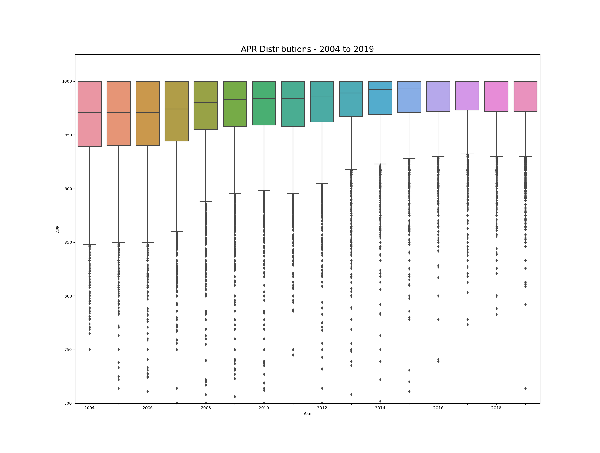
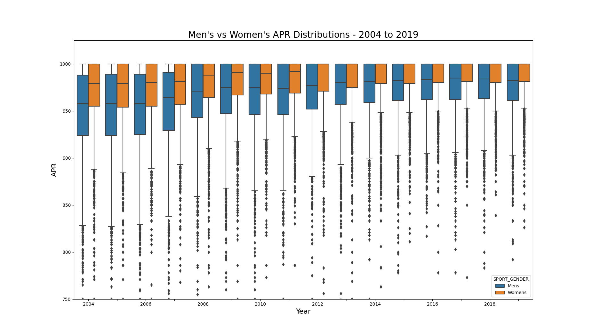
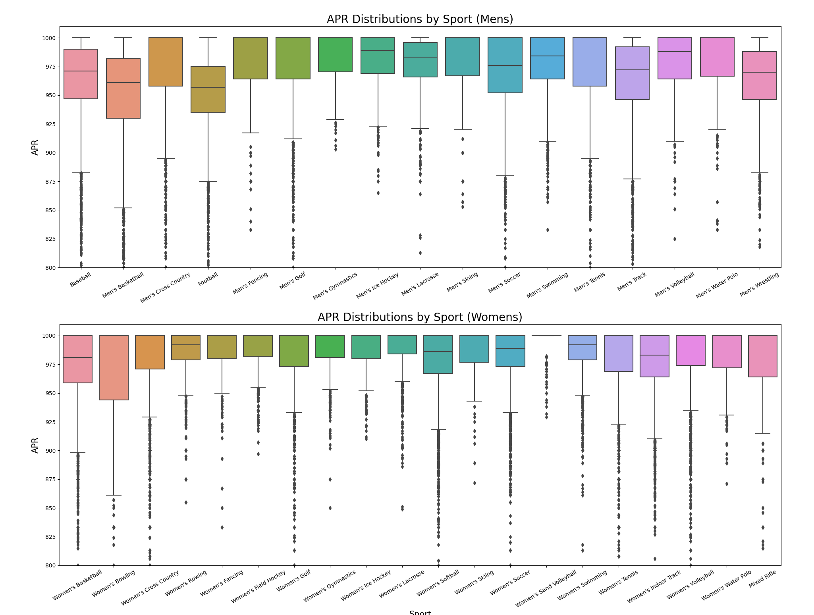

# NCAA Academic Performance

* Data pulled from [NCAA student-athlete academic performance APR](https://www.ncaa.org/about/resources/research/shared-ncaa-research-data). 
  * This page has links to data and documentation for the NCAA Academic Progress Rates (APRs) of student-athletes. 
  * As of January 2023, the CSV for 2004-2019 was last updated in May 2020.

## NCAA Academic Performance Over Time

The distribution of the APRs over time show that there's been an upward trend from 2004 to 2019 with both the median and the lower quartile up 25 APR points. This may indicate that student-athlete academic performance has improved. It may also indicate that the academic standards to of the participating schools lowered over time.

## NCAA Academic Performance Over Time - Men's vs Women's

The Q2 visual shows that women's sports have had a median APR that's about 25 points above men's sports. Over time, both median scores have increased about 50 APR points from 2004 to 2019 (the women's median reached the max APR of 1,000 in 2012). 

# Academic Performance by Sport - Men's vs Women's

Grouping the APR distributions by sport shows again that women's APRs are on average higher than mens. Additionally, there are five specific mens sports that are bringing down the overall median APR for men: baseball, basketball, football, track, and wrestling. 

For women's sports, 10 out of the 19 sports had a median APR of 1,000, which is the maximum available APR score. 

The sports that appear to be the most 'popular' tend to have a lowest APRs. For example, mens football, which is often televised nationally, has the lowest median APR of all sports. This may suggest that schools maintain lower academic standards in admitting student athletes for the more popular sports, resulting in more of these student-athletes either dropping out or becoming ineligible due to poor grades.

# Commands for reproducing the results:
* `make data` to download and format data
* `make q1` for question 1
* `make q2` for question 2
* `make q3` for question 3
* `make clean` to reset
